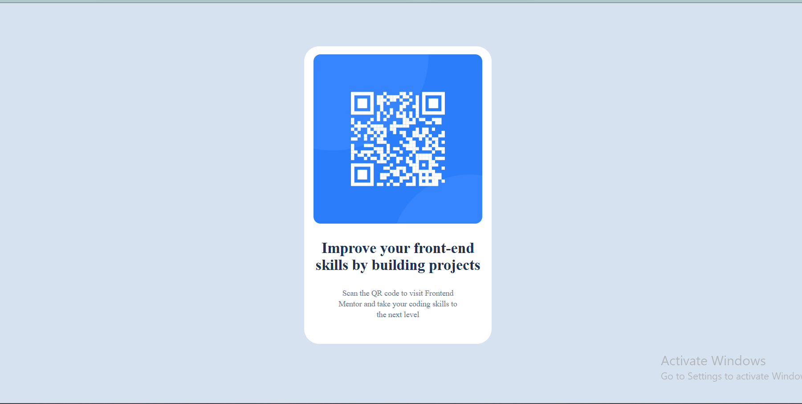

# Frontend Mentor - QR code component solution

This is a solution to the [QR code component challenge on Frontend Mentor](https://www.frontendmentor.io/challenges/qr-code-component-iux_sIO_H). Frontend Mentor challenges help you improve your coding skills by building realistic projects. 

## Table of contents

- [Overview](#overview)
  - [Screenshot](#screenshot)
  - [Links](#links)
- [My process](#my-process)
  - [Built with](#built-with)
  - [What I learned](#what-i-learned)
  

## Overview

### Screenshot

 

### Links

- Solution URL: [Add solution URL here](https://your-solution-url.com)
- Live Site URL: [Add live site URL here](https://your-live-site-url.com)

## My process
I started by recognizing all the possible block elements that I could start with. I set up all the elements, started from top to bottom in html. I went to the css and add the css reset that I am most familiar with. I then started to do the css from top to bottom. I had to guess the font size for the html element at least. I look at the style guide and the figma get the right colors.

### Built with

- Semantic HTML5 markup
- CSS custom properties
- Mobile-first workflow

### What I learned

I got a chance to look at Figma for the first time and get used to learning about the design by observing it in figma, though without the dev tools option available for free in Figma, besides getting accuracy on colors, it doesn't seem to show much

## Author

- Website - [Add your name here](https://vincinchristmas.github.io/VincinChristmasPortfolio/)
- Frontend Mentor - [@yourusername](https://www.frontendmentor.io/profile/VincinChristmas)
- Twitter - [@yourusername](https://x.com/vineo666)

